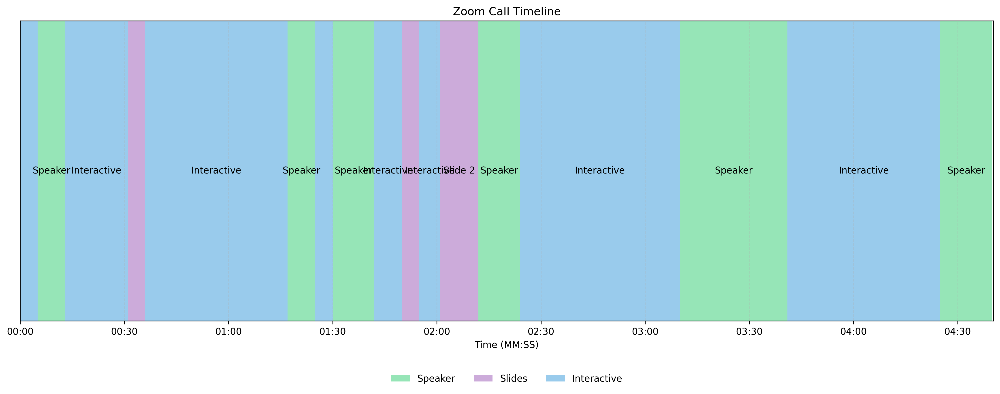

# Zoom Call Analyser

A Python-based system for analyzing Zoom call recordings to detect and classify different types of content (speaker view, slides, screen sharing).

## Features

- **Content Type Detection**: Automatically identifies:
  - Speaker View (when faces are detected)
  - Slides (presentation content)
  - Interactive Content (screen sharing, dynamic content)

- **Multi-Resolution Processing**:
  - Low-res (320x180) initial scanning for efficiency
  - Mid-res (640x360) for content analysis
  - Original resolution available for detailed analysis

- **Smart Change Detection**:
  - Configurable sampling intervals (default: 1.0 second)
  - Temporal smoothing with 15-frame history
  - Perceptual hashing for slide comparison
  - Motion analysis for content stability

- **Timeline Generation**:
  - Visual timeline showing content transitions
  - Summary of activities with timestamps
  - Confidence scores for each detection
  - Detailed metrics for each segment

## Example Output

Here's an example of the timeline visualization generated for a call:



The timeline shows:
- Green segments: Speaker view (with face detection)
- Purple segments: Slides (including slide numbers when detected)
- Blue segments: Interactive content (screen sharing, dynamic content)

The corresponding summary includes detailed metrics for each segment:
```
00:00 - 00:05: Interactive (5.0s, confidence: 0.80)
00:05 - 00:13: Speaker (8.0s, confidence: 0.80)
00:13 - 00:31: Interactive (18.0s, confidence: 0.70)
00:31 - 00:36: Slide 2 (5.0s, confidence: 0.68)
...
```

Each segment includes detailed metrics such as:
- Face detection counts and ratios
- Edge and text density measurements
- Motion magnitude and stability
- Brightness and contrast levels

## Installation

You can install the package in several ways:

### From Source
1. Clone the repository:
   ```bash
   git clone https://github.com/gulliverhandley/recorded_call_analyser.git
   cd recorded_call_analyser
   ```

2. Install in development mode:
   ```bash
   pip install -e .
   ```

## Usage

### Basic Timeline Generation

Generate a timeline of content changes in a Zoom recording:

```bash
# Basic usage (no LLM verification)
PYTHONPATH=. python3 callanalyser/examples/generate_timeline.py path/to/your/recording.mp4

# With LLM verification enabled
PYTHONPATH=. python3 callanalyser/examples/generate_timeline.py path/to/your/recording.mp4 --use-llm --llm-provider anthropic
```

Available options:
- `--use-llm`: Enable LLM-based content verification
- `--llm-provider {openai,anthropic}`: Choose LLM provider (default: anthropic)
- `--sample-interval SECONDS`: Interval between frame samples in seconds (default: 1.0)
- `--min-confidence THRESHOLD`: Minimum confidence threshold for detection (default: 0.3)

This will create:
- `timeline_output/timeline_[videoname].png`: Visual timeline
- `timeline_output/summary_[videoname].txt`: Detailed activity log

#### Example Commands

```bash
# Basic analysis with default settings
PYTHONPATH=. python3 callanalyser/examples/generate_timeline.py video.mp4

# More frequent sampling (every 5 seconds)
PYTHONPATH=. python3 callanalyser/examples/generate_timeline.py video.mp4 --sample-interval 5.0

# Higher confidence threshold with LLM verification
PYTHONPATH=. python3 callanalyser/examples/generate_timeline.py video.mp4 --min-confidence 0.5 --use-llm

# Custom output directory with OpenAI LLM
PYTHONPATH=. python3 callanalyser/examples/generate_timeline.py video.mp4 --use-llm --llm-provider openai
```

### Content Type Detection

The system detects three main types of content:

1. **Speaker View**:
   - Detects faces using Haar Cascade classifier
   - Analyzes face ratio and composition
   - Confidence based on face detection quality
   - Minimum face ratio threshold: 0.04

2. **Slides**:
   - Analyzes edge density (0.008 - 0.045 range)
   - Analyzes text density (minimum 0.002)
   - Uses perceptual hashing to track unique slides
   - Minimum duration: 5.0 seconds

3. **Interactive Content**:
   - Detects dynamic content through motion analysis
   - Minimum motion magnitude: 3.0
   - Uses temporal pattern analysis
   - Distinguishes from static slides

## Project Structure

- `callanalyser/video/`: Core video processing modules
  - `activity_detector.py`: Main content detection logic
  - `change_detector.py`: Frame change detection
  - `processor.py`: Video frame extraction

- `callanalyser/examples/`: Example scripts
  - `generate_timeline.py`: Timeline generation
  - `analyze_metrics.py`: Metric analysis

## Configuration

Key parameters in `activity_detector.py`:

```python
SCREEN_SHARE_THRESHOLD = 0.4  # Screen sharing detection sensitivity
SPEAKER_CHANGE_THRESHOLD = 5.0  # Speaker view change sensitivity
SLIDE_EDGE_DENSITY_MIN = 0.008  # Minimum edge density for slides
SLIDE_EDGE_DENSITY_MAX = 0.045  # Maximum edge density for slides
SLIDE_TEXT_DENSITY_MIN = 0.002  # Minimum text density for slides
SLIDE_MIN_DURATION = 5.0  # Minimum duration for slide segments
MIN_CONFIDENCE = 0.3  # Minimum confidence threshold
STRONG_CONFIDENCE = 0.7  # Strong confidence threshold
```

## Output Files

### Timeline Image
- Shows content type transitions over time
- Color-coded segments for different content types:
  - Green: Speaker View
  - Purple: Slides
  - Blue: Interactive Content
- Labels for segments wider than 2% of total duration
- Slide numbers when detected

### Summary Text
- Detailed log of all detected activities
- Timestamps and durations
- Confidence scores and key metrics
- Face detection and motion statistics
- Edge density and text density measurements

## Development

The project uses Python 3 and OpenCV for video processing. Key dependencies:
- opencv-python: Video frame processing
- numpy: Numerical computations
- matplotlib: Timeline visualization

## License

This project is licensed under the MIT License - see the [LICENSE](LICENSE) file for details.